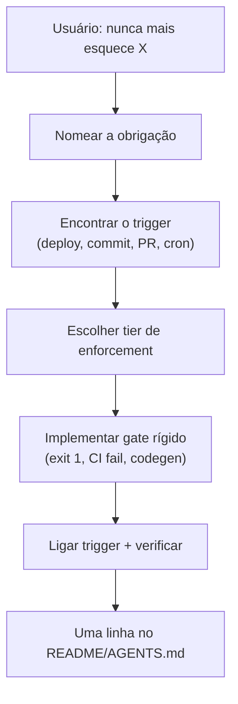

"Sempre incrementa o contador de deploy." Eu disse isso três vezes em três sessões. Três deploys depois, o contador continuava em zero.

O agente concordou em todas. Chegou a criar uma user rule: *lembrar de atualizar deploy-count.json em cada deploy.* Aí abriu um chat novo, o contexto resetou, e o contador ficou parado.

Não é maldade — é como agentes funcionam. Regras escritas e promessas no chat são **fracas**. Competem com a tarefa atual, são puladas sob pressão e somem quando a sessão acaba.

Eu não queria outro lembrete. Queria maquinário que o próximo agente **não consegue furar sem quebrar o build**.

## O que o dont-forget faz

`dont-forget` é uma skill do Cursor que dispara quando você diz coisas como *sempre*, *toda vez*, *nunca esquece*, *em cada deploy* ou *antes de cada commit*. Em vez de escrever outro parágrafo no AGENTS.md, a skill guia o agente a codificar a obrigação como **automação executável**.

A ideia central: escolher o tier de enforcement mais alto que encaixar, implementar o menor gate rígido possível, ligar a um trigger concreto e documentar uma linha apontando pra automação — não um parágrafo pedindo pra agentes futuros lembrarem.



## A escada de enforcement

A skill ranqueia mecanismos por quão bem sobrevivem a um chat novo:

| Tier | Mecanismo | Sobrevive chat novo? | Exemplo |
|------|-----------|---------------------|---------|
| 1 | CI / pipeline de deploy | Sim | Incrementar contador no GitHub Actions |
| 2 | Git hooks | Sim | Bloquear commit se DER não atualizado |
| 3 | Build / test que falha | Sim | `make der-check` no CI |
| 4 | Lint / regras de tipo | Sim | ESLint ou Ruff customizado |
| 5 | Codegen / scaffolder | Sim | OpenAPI → client gerado |
| 6 | Job agendado | Sim | Sync de inventário noturno |
| 7 | Cursor hook / project rule | Parcial | Validador no `afterFileEdit` |
| 8 | Makefile / cadeia npm script | Parcial | `npm run deploy` executa todos os passos |
| 9 | Regra em prosa (AGENTS.md) | Fraca | Último recurso — aponta para tiers 1–8 |

Escolha o **tier mais alto que encaixar**. Regra em prosa só deve **apontar** pra automação, não substituí-la.

## Padrões reais dos meus repos

### Contador de deploy (o que originou isso)

**Ruim:** User rule dizendo "lembrar de incrementar contador de deploy."

**Bom:**

1. `scripts/increment-deploy-count.sh` (ou inline no workflow)
2. Step no `.github/workflows/deploy.yml` depois do health check passar
3. Commitar `deploy-count.json`
4. README: *Contador de deploy incrementa automaticamente no workflow.*

Pular o step → deploy funciona, mas o contador não muda e você percebe na hora. Melhor ainda: fazer o step falhar o job se o arquivo não puder ser escrito.

### Sync schema ↔ DER (nfe_bot)

Mudou `database/schema.sql` sem atualizar `database/der.md`? pre-commit bloqueia. CI roda `make der-check`. O agente não precisa "lembrar" do DER — o commit passa ou não passa.

### E2E antes de dizer que a UI está pronta

Regra do Cursor dizendo "rodar Playwright" é tier 9 — agentes pulam. Job obrigatório `test:e2e` no PR é tier 3. Husky `prepush` é tier 8. Os dois batem "vou rodar os testes antes de terminar."

### Drift do client OpenAPI

`npm run generate:api && git diff --exit-code` no CI. Mudou rota no backend sem regenerar o client → build vermelho. Sem depender de histórico de chat.

## Quando NÃO usar

A skill tem guardrails. Não automatize tudo:

- Tarefa única só na sessão atual
- Trabalho de julgamento sem pass/fail objetivo (tom de copy, tradeoffs de arquitetura)
- Custo da automação maior que o valor (tarefa de 5 minutos por ano)
- Usuário quer checklist manual de propósito

## Anti-padrões que a skill rejeita

| Ruim | Melhor |
|------|--------|
| "Vou incrementar o contador no próximo deploy" | Step no `deploy.yml` incrementa `deploy-count.txt` |
| Seção enorme no AGENTS.md repetindo o mesmo lembrete | `pre-commit` + ponteiro de uma linha |
| Script npm opcional que ninguém roda | Script `deploy` chama ele; CI roda `deploy --dry-run` |
| Comentário `// TODO: não esquece X` | Teste ou lint que falha até X existir |

## Instalação

```bash
npx skills add farukzahra/agent-skills --skill dont-forget
```

Instalação global (todos os projetos em `C:\repo`):

```bash
npx skills add farukzahra/agent-skills --skill dont-forget -g -a cursor -y
```

Listagem: [skills.sh/farukzahra/agent-skills/dont-forget](https://www.skills.sh/farukzahra/agent-skills/dont-forget)

Fonte: [github.com/farukzahra/agent-skills](https://github.com/farukzahra/agent-skills) — skill em `skills/dont-forget/`.

## O que o agente reporta de volta

Depois de implementar, a skill exige que o agente diga:

1. **O quê** está sendo enforced
2. **Onde** (arquivo + trigger)
3. **O que falha** se pular
4. Que sessões futuras **não** dependem de memória

Chega de "vou lembrar." Ou o build passa, ou não passa.

Se você já disse a mesma coisa duas vezes pro agente e ele não fez — para de escrever lembretes. Escreve um gate.
