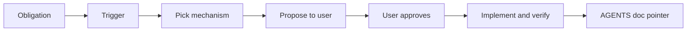

Pedi pro agente incrementar o contador de deploy em cada deploy de produção. Ele concordou. Chegou a criar user rule. Na sessão seguinte, `deploy-count.json` continuava em zero.

Não foi a primeira vez. Peço pro agente lembrar de cada vez mais coisa — DER, E2E antes de dizer que terminou, sync do client OpenAPI — e o padrão é sempre o mesmo: **sim no chat, nada no repo**.

Não estou tentando consertar a memória do agente. Estou tentando parar de depender dela.

## O que eu quero de verdade

Quando digo *sempre*, *em cada deploy*, *nunca esquece*, não quero outro parágrafo no `AGENTS.md`. Quero que o agente olhe a obrigação, escolha o **trigger** (commit, deploy, PR, cron), decida qual **gate executável** encaixa neste codebase — step no workflow, hook, teste que falha, diff de codegen — e **me mostre o plano antes de editar qualquer arquivo**.

Eu aprovo (ou ajusto). Aí ele implementa. Uma linha no `AGENTS.md` aponta pra automação. Sessões futuras descobrem pelos arquivos, não pelo histórico do chat.

Esse é o coração do [`dont-forget`](https://www.skills.sh/farukzahra/agent-skills/dont-forget): não "lembrar melhor", mas **propor enforcement, ganhar aprovação, commitar maquinário**.



Não é "guardrails" de safety de LLM (bloquear output ruim). É **enforcement** — software que checa se algo importante de fato aconteceu.

## Contador de deploy — como a proposta deveria ser

Mesmo pedido: incrementar contador todo deploy, agente já tinha esquecido antes.

**Errado:** user rule *"lembrar de atualizar deploy-count.json."*

**Certo:** antes de qualquer edição, algo assim:

> **Obrigação:** `deploy-count.json` incrementa em cada deploy de produção bem-sucedido.  
> **Trigger:** `.github/workflows/deploy.yml`, depois do health check passar.  
> **Mecanismo:** step no workflow roda `scripts/increment-deploy-count.sh`.  
> **Arquivos:** workflow, script, arquivo do contador.  
> **Se pular:** job de deploy falha (melhor que contador parado em silêncio).  
> **AGENTS.md:** `Deploy count: see .github/workflows/deploy.yml`  
>  
> Aprova pra implementar?

Depois da aprovação: adiciona o step, roda uma vez, confirma que falha quando pulado. Pronto. Sem "vou lembrar na próxima."

A skill traz uma **escada de enforcement** (CI e pipeline de deploy vencem regra em prosa) pra o agente ter um menu ranqueado — mas a escolha é contextual. Hook pode ganhar do CI em pre-commit; codegen pode ganhar dos dois em drift de OpenAPI. O agente decide; eu confirmo.

## Quando não usar

Tarefa única nesta sessão. Julgamento sem pass/fail objetivo. Coisa onde automação custa mais que fazer manual uma vez por ano. Quando eu quero checklist manual de propósito.

## Instalação

```bash
npx skills add farukzahra/agent-skills --skill dont-forget
```

Global (todos os projetos):

```bash
npx skills add farukzahra/agent-skills --skill dont-forget -g -a cursor -y
```

Fonte: [github.com/farukzahra/agent-skills](https://github.com/farukzahra/agent-skills) — `skills/dont-forget/`.

Se você já repetiu a mesma instrução duas vezes e não colou — não escreve outro lembrete. Pede pro agente o que enforcear, lê a proposta, e deixa o repo lembrar por você.
