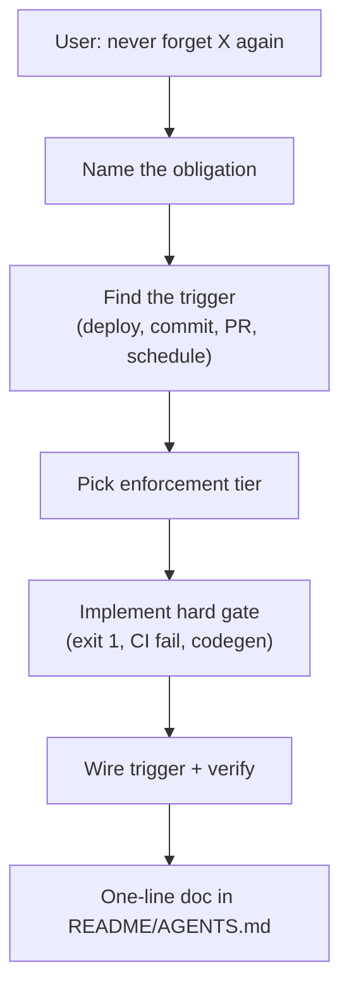

"Always increment the deploy counter." I said it three times across three sessions. Three deploys later, the counter was still at zero.

The agent had agreed every time. It even added a user rule: *remember to bump deploy-count.json on each deploy.* Then a new chat started, context reset, and the counter stayed frozen.

That's not malice — it's how agents work. Written rules and chat promises are **soft**. They compete with the current task, get skipped under pressure, and vanish when the session ends.

I didn't want another reminder. I wanted machinery the next agent **cannot bypass without breaking the build**.

## What dont-forget does

`dont-forget` is a Cursor skill that triggers when you say things like *always*, *every time*, *never forget*, *on each deploy*, or *before every commit*. Instead of writing a longer AGENTS.md paragraph, the skill walks the agent through encoding the obligation as **executable automation**.

The core idea: pick the highest enforcement tier that fits, implement the smallest hard gate, wire it to a concrete trigger, and document one line pointing at the automation — not a paragraph asking future agents to remember.



## The enforcement ladder

The skill ranks mechanisms by how well they survive a new chat:

| Tier | Mechanism | Survives new chat? | Example |
|------|-----------|-------------------|---------|
| 1 | CI / deploy pipeline | Yes | Bump deploy counter in GitHub Actions |
| 2 | Git hooks | Yes | Block commit if DER not updated |
| 3 | Build / test failure | Yes | `make der-check` in CI |
| 4 | Lint / type rules | Yes | Custom ESLint or Ruff check |
| 5 | Codegen / scaffolder | Yes | OpenAPI → client generation |
| 6 | Scheduled job | Yes | Nightly inventory sync |
| 7 | Cursor hook / project rule | Partial | Validator on `afterFileEdit` |
| 8 | Makefile / npm script chain | Partial | `npm run deploy` runs all steps |
| 9 | Prose rule (AGENTS.md) | Weak | Last resort — points at tiers 1–8 |

Pick the **highest tier that fits**. A prose rule should only **point at** the automation, not replace it.

## Real patterns from my repos

### Deploy counter (the one that started this)

**Bad:** User rule saying "remember to increment deploy count."

**Good:**

1. `scripts/increment-deploy-count.sh` (or inline in workflow)
2. Step in `.github/workflows/deploy.yml` after health check passes
3. Commit `deploy-count.json`
4. README: *Deploy count auto-increments in deploy workflow.*

Skip the step → deploy still works, but the counter doesn't move and you notice immediately. Better: make the step fail the job if the file can't be written.

### Schema ↔ DER sync (nfe_bot)

Change `database/schema.sql` without updating `database/der.md`? pre-commit blocks it. CI runs `make der-check`. The agent doesn't need to "remember" the DER — the commit either passes or it doesn't.

### E2E before claiming UI done

A Cursor rule saying "run Playwright" is tier 9 — agents skip it. Required `test:e2e` job on PR is tier 3. Husky `prepush` is tier 8. Both beat "I'll run tests before finishing."

### OpenAPI client drift

`npm run generate:api && git diff --exit-code` in CI. Backend route changes without regenerating the client → red build. No chat history required.

## When NOT to use it

The skill has guardrails. Don't automate everything:

- One-off tasks in the current session only
- Judgment-heavy work with no objective pass/fail (copy tone, architecture tradeoffs)
- Automation cost exceeds value (a 5-minute yearly task)
- User explicitly wants a manual checklist

## Anti-patterns the skill rejects

| Bad | Better |
|-----|--------|
| "I'll increment the counter next deploy" | Step in `deploy.yml` increments `deploy-count.txt` |
| Long AGENTS.md section repeating the same reminder | `pre-commit` + one-line pointer |
| Optional npm script nobody runs | `deploy` script calls it; CI runs `deploy --dry-run` |
| Comment `// TODO: don't forget X` | Test or lint that fails until X exists |

## Install

```bash
npx skills add farukzahra/agent-skills --skill dont-forget
```

Global install (all projects under `C:\repo`):

```bash
npx skills add farukzahra/agent-skills --skill dont-forget -g -a cursor -y
```

Listing: [skills.sh/farukzahra/agent-skills/dont-forget](https://www.skills.sh/farukzahra/agent-skills/dont-forget)

Source: [github.com/farukzahra/agent-skills](https://github.com/farukzahra/agent-skills) — skill lives in `skills/dont-forget/`.

## What the agent reports back

After implementing, the skill requires the agent to state:

1. **What** is enforced
2. **Where** (file + trigger)
3. **What fails** if skipped
4. That future sessions do **not** rely on memory

No more "I'll remember." Either the build passes or it doesn't.

If you've told an agent the same thing twice and it still didn't stick — stop writing reminders. Write a gate.
