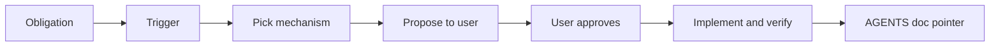

I asked the agent to increment the deploy counter on every production deploy. It agreed. It even added a user rule. Next session, `deploy-count.json` was still at zero.

That was not the first time. I am asking agents to remember more and more — DER updates, E2E before "done", OpenAPI client sync — and the pattern is always the same: **yes in chat, nothing in the repo**.

I am not trying to fix agent memory. I am trying to stop relying on it.

## What I actually want

When I say *always*, *every deploy*, *never forget*, I do not want another paragraph in `AGENTS.md`. I want the agent to look at the obligation, pick a **trigger** (commit, deploy, PR, schedule), decide what **executable gate** fits this codebase — workflow step, hook, test that fails, codegen diff — and **show me the plan before editing anything**.

I approve (or adjust). Then it implements. One line in `AGENTS.md` points at the automation. Future sessions discover it from files, not from chat history.

That is the heart of [`dont-forget`](https://www.skills.sh/farukzahra/agent-skills/dont-forget): not "remember better," but **propose enforcement, get approval, commit machinery**.



This is not "AI safety guardrails" (blocking bad outputs). It is **enforcement** — software that checks whether something important actually happened.

## Deploy counter — how the proposal should look

Same request: increment counter every deploy, agent forgot before.

**Wrong:** user rule *"remember to bump deploy-count.json."*

**Right:** before any file edit, something like:

> **Obligation:** `deploy-count.json` increments on every successful production deploy.  
> **Trigger:** `.github/workflows/deploy.yml`, after health check passes.  
> **Mechanism:** workflow step runs `scripts/increment-deploy-count.sh`.  
> **Files:** workflow, script, counter file.  
> **If skipped:** deploy job fails (prefer this over a silent stale counter).  
> **AGENTS.md:** `Deploy count: see .github/workflows/deploy.yml`  
>  
> Approve to implement?

After approval: add the step, run it once, confirm failure when skipped. Done. No "I'll remember next time."

The skill includes an **enforcement ladder** (CI and deploy pipelines beat prose rules) so the agent has a ranked menu — but the choice is contextual. A hook might beat CI for pre-commit checks; codegen might beat both for OpenAPI drift. The agent decides; I confirm.

## When it does not apply

One-off work in this session. Judgment calls with no objective pass/fail. Tasks where automation costs more than a once-a-year manual step. When I explicitly want a manual checklist only.

## Install

```bash
npx skills add farukzahra/agent-skills --skill dont-forget
```

Global (all projects):

```bash
npx skills add farukzahra/agent-skills --skill dont-forget -g -a cursor -y
```

Source: [github.com/farukzahra/agent-skills](https://github.com/farukzahra/agent-skills) — `skills/dont-forget/`.

If you have repeated the same instruction twice and nothing stuck — do not write another reminder. Ask the agent what to enforce, read the proposal, and let the repo remember for you.
