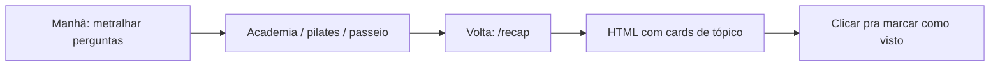

Minha rotina de manhã é assim: acordo, abro o Cursor e **descarrego um monte de perguntas** no agente que estiver ouvindo. Três projetos, seis assuntos, um refactor aqui, um bug ali — tudo antes do café.

Aí eu saio. Academia. Pilates. Um passeio. Vida normal.

Quando volto, abro o mesmo chat e… **não faço ideia de onde eu estava.** O agente deixou um muro de texto. Eu rolo. Eu escaneio. Perco dez minutos só pra lembrar o que eu pedi e o que de fato saiu.

Não procurei no skills.sh. Não comparei alternativas. Só escrevi o que eu precisava e publiquei.

## O que o /recap faz

Digite **`/recap`** (ou peça um resumo da sessão). O agente lê a conversa atual, agrupa turnos relacionados em tópicos e salva um **arquivo HTML autocontido**:

| Bloco | Conteúdo |
|-------|----------|
| **Pedido** | O que você queria — linguagem simples, 1–2 frases |
| **Entregue** | O que de fato saiu — arquivos, rotas, testes, paths |

Máximo de ~8–12 cards por tópico. Sem dump de transcript. Sem secrets do `.env`.



## A parte que de fato me ajuda

A skill atualizada faz três coisas que importam pra mim:

**1. HTML escuro que dá pra escanear em 30 segundos.** Não é um blob de markdown no chat — é uma página de verdade com cards, tipografia e contraste. Dark mode por padrão.

**2. Clica no card pra marcar como visto.** Cada tópico tem um id estável. Clique (ou Enter/Espaço) alterna "Visto" — o estado persiste no `localStorage`. Chip de progresso no header: `3/7 vistos`. Abro o recap, marco o que já absorvi, e sei exatamente o que falta.

**3. URLs locais de dev na página.** Se o projeto tem servidor de dev, a skill sobe (quando as regras mandam), valida HTTP 200 e coloca a URL efetiva no recap — pill links, health dot. Não fico caçando `localhost:4321` vs `3000` depois do pilates.

O arquivo vai pra `docs/session-recaps/YYYY-MM-DD-<slug>.html` quando o projeto tem `docs/`; senão `session-recap.html` na raiz do workspace.

## Instalação

```bash
npx skills add farukzahra/agent-skills --skill recap
```

Listagem: [skills.sh/farukzahra/agent-skills/recap](https://www.skills.sh/farukzahra/agent-skills/recap)

Se você tem o mesmo problema — metralhada de manhã, amnésia à tarde — usa aí. Fiz pra mim.

## Regras de qualidade embutidas

- **Conciso** — um card por tópico, sem muro de código
- **Preciso** — só afirma o que de fato foi entregue
- **Sem secrets** — tokens e senhas ficam fora do HTML

Seção **Pendências** opcional no final se algo ainda estiver em aberto. Útil quando o próprio recap te avisa que você não terminou.
