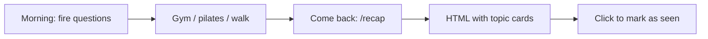

My morning routine looks like this: wake up, open Cursor, and **unload a pile of questions** at whatever agent is listening. Three projects, six topics, a refactor here, a bug there — all before breakfast.

Then I leave. Gym. Pilates. A walk. Normal life.

When I come back, I open the same chat and… **I have no idea where I was.** The agent left a wall of text. I scroll. I skim. I lose ten minutes just remembering what I asked for and what actually shipped.

I didn't search skills.sh. I didn't compare alternatives. I just wrote what I needed and published it.

## What /recap does

Type **`/recap`** (or ask for a session summary). The agent reads the current conversation, groups related turns into topics, and saves a **self-contained HTML file**:

| Block | Content |
|-------|---------|
| **Requested** | What you wanted — plain language, 1–2 sentences |
| **Delivered** | What actually shipped — files, routes, tests, paths |

Max ~8–12 topic cards. No transcript dump. No secrets from `.env`.



## The part that actually helps me

The updated skill does three things I care about:

**1. Dark HTML you can skim in 30 seconds.** Not a markdown blob in chat — a real page with cards, typography, and contrast. Dark mode by default.

**2. Click a card to mark it as seen.** Each topic has a stable id. Click (or Enter/Space) toggles "Visto" — state persists in `localStorage`. Progress chip in the header: `3/7 seen`. I open the recap, tick off what I already absorbed, and know exactly what's left.

**3. Local dev URLs on the page.** If the project has a dev server, the skill starts it (when rules say so), validates HTTP 200, and puts the effective URL on the recap — pill links, health dot. I don't hunt for `localhost:4321` vs `3000` after pilates.

Output lands in `docs/session-recaps/YYYY-MM-DD-<slug>.html` when the project has `docs/`; otherwise `session-recap.html` at the workspace root.

## Install

```bash
npx skills add farukzahra/agent-skills --skill recap
```

Listing: [skills.sh/farukzahra/agent-skills/recap](https://www.skills.sh/farukzahra/agent-skills/recap)

If you have the same problem — morning blitz, afternoon amnesia — use it. I built it for myself.

## Quality rules baked in

- **Concise** — one card per topic, no code walls
- **Accurate** — only claim what was actually delivered
- **No secrets** — tokens and passwords stay out of the HTML

Optional **Pending** section at the bottom if something is still open. Useful when the recap itself tells you you're not done yet.
