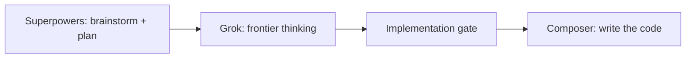

Eu não rodo o modelo caro em todo turno. Rodo o [Superpowers](https://github.com/obra/superpowers) no **Grok** até o design estar assinado e o plano de implementação existir. Aí eu troco para o **Composer** e deixo ele escrever o código.

Esse split é o artigo inteiro.

Estou desempregado. A assinatura do Cursor não é cartão da empresa. Se eu queimo o mês num modelo max-tier em todo CRUD, todo rename e todo "só arruma esse teste", acaba o trabalho que ainda precisa sair. Isso não é post de estoicismo. É aritmética de token.

## Por que eu escolhi o Cursor

Comparei os três produtos que eu de fato ia pagar: **Cursor**, **Codex** e **Claude**. O Cursor ganhou no custo-benefício. O Codex é um loop forte de código se você já vive naquele ecossistema. O Claude é um loop forte de pensamento se você já vive naquele. Eu não estava comprando um loop só. Estava comprando um editor onde consigo manter skills, rules e o seletor de modelo no mesmo agente — e trocar o modelo no portão de implementação sem exportar a spec para outro app.

O harness é o motivo de eu ficar. Skills, rules, Agent Skills, o jeito do Superpowers forçar brainstorm → spec → plan → implement em vez de "beleza, já começo a digitar." Já escrevi sobre esse loop neste blog: [as skills do Matt Pocock num CRUD Java](/articles/agents/matt-pocock-skills-harness-product-crud-pt-br/) e [parar nas issues do GitHub antes do código](/articles/agents/github-issues-skills-planning-zoora-pt-br/). O editor é o produto que eu estou otimizando. Um modelo cru mais barato em outra janela de chat não ajuda se eu perco esse loop.

A documentação do Cursor divide o uso em dois pools: **Cursor Models** (Grok e Composer, com mais uso incluso) e **Other Models** (terceiros, cobrados no preço de API). Eu moro no primeiro de propósito. Claude e os picks classe GPT ficam no segundo. Esse é o custo-benefício que eu sinto no fim do mês — não uma planilha de list price que vai estar errada no próximo release.

## Ainda não fui para os modelos chineses

Eles estão no seletor. São mais baratos. Eu não troquei.

O que eu estaria comprando é token. O que eu não quero deixar é o harness que já liguei — Superpowers, skills do projeto, as rules que fazem o agente parar e perguntar. Talvez depois, quando eu estiver avaliando modelo como modelo. Não neste mês, quando estou avaliando se consigo continuar entregando sem atear fogo no plano.

## O split

**Grok** é o modelo de fronteira que eu de fato escolho dentro do Cursor. Ele mora no pool Cursor Models, então eu não gasto a cota de terceiro em pensamento. Superpowers — [obra/superpowers](https://github.com/obra/superpowers) — é o processo: brainstorming, uma spec escrita, `writing-plans`, e só então implementação.

Uma sessão de Superpowers no Grok, da minha cadeira, é assim. O agente lê o repo. Pergunta uma coisa de cada vez. Propõe duas ou três abordagens em vez de um default único. Escreve uma spec que eu posso recusar. Depois escreve um plano que outro modelo consegue seguir. Estou pagando token de fronteira por julgamento, não por diff em `src/`. Essa é a única fase em que eu quero o modelo que pensa como staff engineer.

**Composer** é o modelo de código do próprio Cursor. Mesmo pool first-party, mais barato que o Grok na tabela, treinado para conduzir o agente pelos arquivos. Quando a spec e o plano existem, eu não preciso de julgamento de fronteira em cada edit. Preciso de um modelo que segue o plano e digita. Composer é esse modelo para mim. Não é o modelo que eu quero inventando a arquitetura no mesmo turno.

O portão de implementação é um **go** humano. Até eu dizer isso, o Grok não pode scaffoldar a feature. Depois que eu digo, o Composer não pode reabrir a arquitetura. Se o plano estava errado, eu volto para o Grok e o Superpowers. Não deixo o implementador "melhorar" o design no mesmo fôlego em que escreve o CRUD.

É o mesmo instinto das sessões do faruk-base2: grill até as decisões existirem, depois implementar. A diferença é que agora eu separo **qual modelo** senta de cada lado dessa linha. Superpowers sem split de modelo ainda funciona. Só custa mais, porque o modelo de fronteira continua digitando depois de ter que ter parado de pensar.

## O que eu não faço

Não deixo o Grok digitar o CRUD. Token de fronteira em boilerplate é como esvaziar um pool e ainda ter spec inacabada.

Não deixo o Composer decidir a arquitetura sozinho. Ele escolhe um default e segue. Esse é o modo de falha que eu já tomei quando um harness de skills pulou a entrevista: você ganha *uma* feature, não *a sua* feature.

Não pino um modelo third-party max-tier em todo turno porque o chat "parece mais inteligente." Mais inteligente que um plano fechado geralmente é só mais caro. Se o plano está fechado, Composer basta. Se o plano não está fechado, eu ainda não estou no modelo de implementação.

Também não finjo que isso é benchmark. Não rodei bake-off com leaderboard. Rodei orçamento. Cursor mais Superpowers mais esse split é a combinação que me deixa continuar trabalhando.

## O modelo caro pensa

O mais barato executa um plano que eu já assinei. O Cursor fica porque o harness torna esse split exigível — skills que recusam código antes da spec, um arquivo de plano que outro modelo consegue seguir, um portão humano que diz go.

Estou desempregado, então preciso que o mês dure até eu ter algo para mostrar. Usar o modelo de fronteira para pensar, e o Composer para codar, é como eu compro esse mês.
