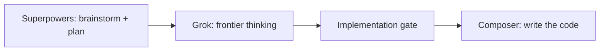

I do not run the expensive model on every turn. I run [Superpowers](https://github.com/obra/superpowers) on **Grok** until the design is signed and the implementation plan exists. Then I switch to **Composer** and let it write the code.

That split is the whole article.

I am unemployed. The Cursor subscription is not a company card. If I burn the month on a max-tier model for every CRUD, every rename, and every "just fix this test," I run out of the work that still has to ship. This is not a stoicism post. It is token arithmetic.

## Why I picked Cursor

I compared the three products I was actually going to pay for: **Cursor**, **Codex**, and **Claude**. Cursor won on cost-benefit. Codex is a strong coding loop if you already live in that ecosystem. Claude is a strong thinking loop if you already live in that one. I was not buying a single loop. I was buying an editor where I can keep skills, rules, and a model picker in the same agent — and swap the model at the implementation gate without exporting the spec to another app.

The harness is why I stay. Skills, rules, Agent Skills, the way Superpowers can force brainstorm → spec → plan → implement instead of "sure, I'll start typing." I already wrote about that loop on this blog: [Matt Pocock's skills on a Java CRUD](/articles/agents/matt-pocock-skills-harness-product-crud/) and [stopping at GitHub issues before code](/articles/agents/github-issues-skills-planning-zoora/). The editor is the product I am optimizing. A cheaper raw model in another chat window does not help if I lose that loop.

Cursor's own docs split usage into two pools: **Cursor Models** (Grok and Composer, with more included usage) and **Other Models** (third-party, billed at API rates). I live in the first pool on purpose. Claude and the GPT-class picks sit in the second. That is the cost-benefit I actually feel at the end of the month — not a spreadsheet of list prices that will be wrong by the next release.

## I have not gone to the Chinese models yet

They are on the picker. They are cheaper. I have not switched.

What I would be buying is tokens. What I do not want to leave is the harness I already wired — Superpowers, project skills, the rules that make an agent stop and ask. Maybe later, when I am evaluating models as models. Not this month, when I am evaluating whether I can keep shipping without lighting the plan on fire.

## The split

**Grok** is the frontier model I actually pick inside Cursor. It lives in the Cursor Models pool, so I am not spending the third-party allowance on thinking. Superpowers — [obra/superpowers](https://github.com/obra/superpowers) — is the process: brainstorming, a written spec, `writing-plans`, then — and only then — implementation.

A Superpowers session on Grok looks like this from my chair. The agent reads the repo. It asks one question at a time. It proposes two or three approaches instead of a single default. It writes a spec I can reject. Then it writes a plan another model can follow. I am paying frontier tokens for judgment, not for `src/` diffs. That is the only phase where I want the model that thinks like a staff engineer.

**Composer** is Cursor's own coding model. Same first-party pool, cheaper than Grok on the rate card, trained to drive the agent through files. Once the spec and the plan exist, I do not need frontier judgment on every edit. I need a model that follows the plan and types. Composer is that model for me. It is not the model I want inventing the architecture in the same turn.

The implementation gate is a human **go**. Until I say that, Grok is not allowed to scaffold the feature. After I say it, Composer is not allowed to reopen the architecture. If the plan was wrong, I go back to Grok and Superpowers. I do not let the implementer "improve" the design in the same breath it writes the CRUD.

This is the same instinct as the faruk-base2 sessions: grill until the decisions exist, then implement. The difference is I now split **which model** sits on each side of that line. Superpowers without a model split still works. It just costs more, because the frontier model keeps typing after it should have stopped thinking.

## What I do not do

I do not let Grok type the CRUD. Frontier tokens on boilerplate is how you empty a pool and still have an unfinished spec.

I do not let Composer decide the architecture alone. It will pick a default and move. That is the failure mode I already hit when a skills harness skipped the interview: you get *a* feature, not *your* feature.

I do not pin a max-tier third-party model on every turn because the chat "feels smarter." Smarter than a closed plan is usually just more expensive. If the plan is closed, Composer is enough. If the plan is not closed, I am not in the implementation model yet.

I also do not pretend this is a benchmark. I did not run a bake-off with a leaderboard. I ran a budget. Cursor plus Superpowers plus this split is the combination that lets me keep working.

## The expensive model thinks

The cheaper one executes a plan I already signed. Cursor stays because the harness makes that split enforceable — skills that refuse to code before a spec, a plan file another model can follow, a human gate that says go.

I am unemployed, so I need the month to last until I have something to show. Using the frontier model for thinking, and Composer for typing, is how I buy that month.
